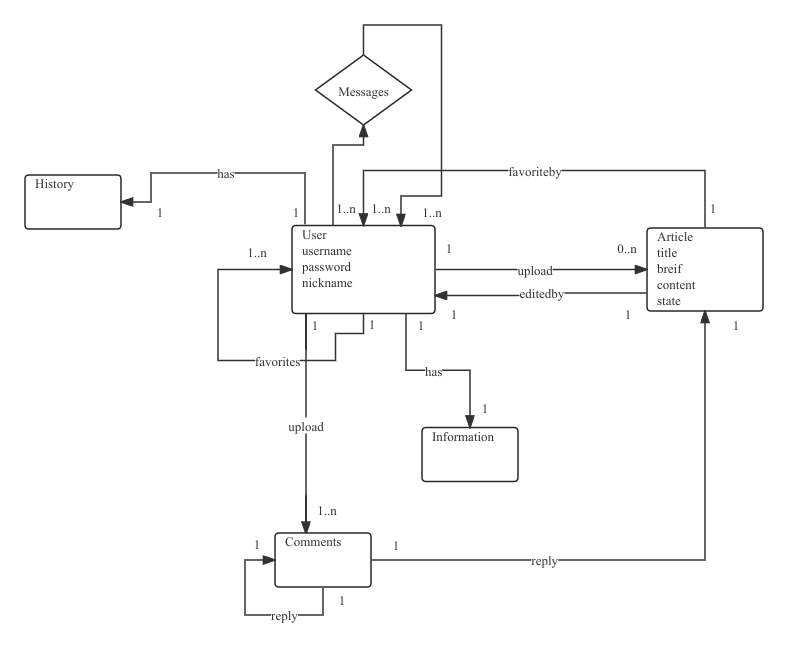

# BSDN

​		A BLOG platform with a markdown editor.

​	Entity Design

​			

​			User (user_id,user_name,nickname,password,role{user,admin},avatar)

​			Article(article_id,uploader_id,Content,title,click_count,favorites,state,upload_time,mes,brief)

​			Message(message_id,user_from_id,user_to_id,content,time)

​			Information(Information_id,QQ,birth_date,introduction,Article_count,

​			favorites_count,fans_count,click_counts)

​			Comments(comments_id,ariticle_id,user_id,content,father_comments_id,time)

​			Favorites(user_id,user_id)

​			History(user_id,article_id,time)

​	ER Design

​					

​		

​				
